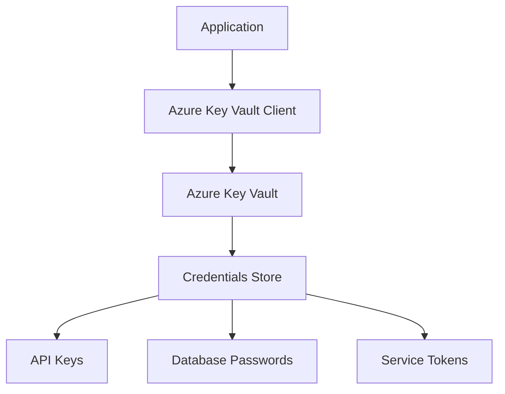

# Security Credential Management

## Overview

This document outlines the security credential management strategy for the bar-directory-recon project, implementing Azure Key Vault for secure credential storage and retrieval.

## Azure Key Vault Integration

### Architecture

The project uses Azure Key Vault to securely manage all sensitive credentials, replacing environment variable-based storage with enterprise-grade security.



### Prerequisites

1. **Azure Subscription**: Active Azure subscription with Key Vault service enabled
2. **Service Principal**: Azure AD service principal with Key Vault access permissions
3. **Authentication**: Azure CLI or managed identity for authentication

### Setup

#### 1. Install Dependencies

```bash
pip install azure-keyvault-secrets azure-identity
```

#### 2. Create Key Vault

```bash
# Create resource group
az group create --name rg-bar-directory-recon --location eastus

# Create Key Vault
az keyvault create --name kv-bar-directory-recon --resource-group rg-bar-directory-recon --location eastus
```

#### 3. Configure Access Policies

```bash
# Grant access to service principal
az keyvault set-policy --name kv-bar-directory-recon --spn <service-principal-id> --secret-permissions get list set delete
```

### Configuration

#### Environment Variables (Minimal)

Only authentication-related environment variables are retained:

```bash
# Azure authentication
AZURE_CLIENT_ID=<service-principal-client-id>
AZURE_CLIENT_SECRET=<service-principal-secret>
AZURE_TENANT_ID=<azure-tenant-id>
AZURE_KEYVAULT_URL=https://kv-bar-directory-recon.vault.azure.net/
```

#### Key Vault Secret Names

Standardized secret naming convention:

```
# API Keys
hunter-api-key
zerobounce-api-key
google-sheets-credentials
twilio-account-sid
twilio-auth-token

# Email Configuration
smtp-server
smtp-port
email-username
email-password
from-email
to-emails

# Database Credentials
database-url
database-password

# External Services
discord-webhook-url
slack-webhook-url
```

## Implementation

### Core Security Manager

The `SecurityManager` class provides centralized credential management:

```python
from src.security_manager import SecurityManager

# Initialize security manager
security = SecurityManager()

# Retrieve credentials
api_key = security.get_secret("hunter-api-key")
db_password = security.get_secret("database-password")
```

### Usage Patterns

#### 1. API Key Retrieval

```python
# Before (environment variables)
import os
api_key = os.getenv('HUNTER_API_KEY')

# After (Azure Key Vault)
from src.security_manager import SecurityManager
security = SecurityManager()
api_key = security.get_secret("hunter-api-key")
```

#### 2. Configuration Integration

```python
# In config_loader.py
class ConfigLoader:
    def __init__(self):
        self.security = SecurityManager()

    def get_email_config(self):
        return {
            'smtp_server': self.security.get_secret("smtp-server"),
            'smtp_port': int(self.security.get_secret("smtp-port")),
            'username': self.security.get_secret("email-username"),
            'password': self.security.get_secret("email-password")
        }
```

## Security Best Practices

### 1. Credential Rotation

- **Automated Rotation**: Implement automated credential rotation for API keys
- **Lifecycle Management**: Regular review and update of stored credentials
- **Access Auditing**: Monitor Key Vault access logs

### 2. Access Control

- **Principle of Least Privilege**: Grant minimal required permissions
- **Role-Based Access**: Use Azure RBAC for granular permission control
- **Network Security**: Restrict Key Vault access to specific networks

### 3. Development vs Production

#### Development Environment

```python
# Use development Key Vault for testing
AZURE_KEYVAULT_URL=https://kv-bar-directory-recon-dev.vault.azure.net/
```

#### Production Environment

```python
# Use production Key Vault with stricter access controls
AZURE_KEYVAULT_URL=https://kv-bar-directory-recon-prod.vault.azure.net/
```

### 4. Fallback Strategy

```python
class SecurityManager:
    def get_secret(self, secret_name: str, fallback_env_var: str = None) -> str:
        try:
            # Primary: Azure Key Vault
            return self._get_from_keyvault(secret_name)
        except Exception as e:
            if fallback_env_var:
                # Fallback: Environment variable (development only)
                return os.getenv(fallback_env_var)
            raise
```

## Migration Guide

### Phase 1: Infrastructure Setup

1. Create Azure Key Vault
2. Configure service principal
3. Install dependencies

### Phase 2: Code Migration

1. Implement `SecurityManager` class
2. Replace `os.getenv()` calls
3. Update configuration classes

### Phase 3: Secret Migration

1. Upload secrets to Key Vault
2. Test credential retrieval
3. Remove environment variables

### Phase 4: Validation

1. Run integration tests
2. Verify all services connect
3. Monitor Key Vault access logs

## Monitoring and Alerts

### Key Vault Metrics

- **Access Frequency**: Monitor credential access patterns
- **Failed Requests**: Alert on authentication failures
- **Unusual Activity**: Detect anomalous access patterns

### Application Integration

```python
import logging

class SecurityManager:
    def get_secret(self, secret_name: str) -> str:
        try:
            secret = self._get_from_keyvault(secret_name)
            logging.info(f"Successfully retrieved secret: {secret_name}")
            return secret
        except Exception as e:
            logging.error(f"Failed to retrieve secret {secret_name}: {e}")
            raise
```

## Compliance and Auditing

### Audit Requirements

- **Access Logs**: All Key Vault access is logged
- **Change Tracking**: Secret modifications are tracked
- **Compliance Reporting**: Regular security compliance reports

### Data Classification

- **Highly Sensitive**: Database passwords, API keys
- **Sensitive**: Email credentials, webhook URLs
- **Internal**: Configuration settings, feature flags

## Troubleshooting

### Common Issues

1. **Authentication Failures**
   - Verify service principal credentials
   - Check Key Vault access policies
   - Validate network connectivity

2. **Secret Not Found**
   - Verify secret name spelling
   - Check Key Vault permissions
   - Ensure secret exists

3. **Connection Timeouts**
   - Check network connectivity
   - Verify Key Vault URL
   - Review firewall settings

### Debugging Commands

```bash
# Test Azure CLI access
az keyvault secret list --vault-name kv-bar-directory-recon

# Test secret retrieval
az keyvault secret show --name hunter-api-key --vault-name kv-bar-directory-recon
```

## Version History

- **v1.0** (2025-08-06): Initial Azure Key Vault integration
- **v1.1** (Planned): Automated credential rotation
- **v1.2** (Planned): Multi-region Key Vault support

---

**Security Contact**: For security-related questions or incident reporting, please create a GitHub issue with the `security` label.
